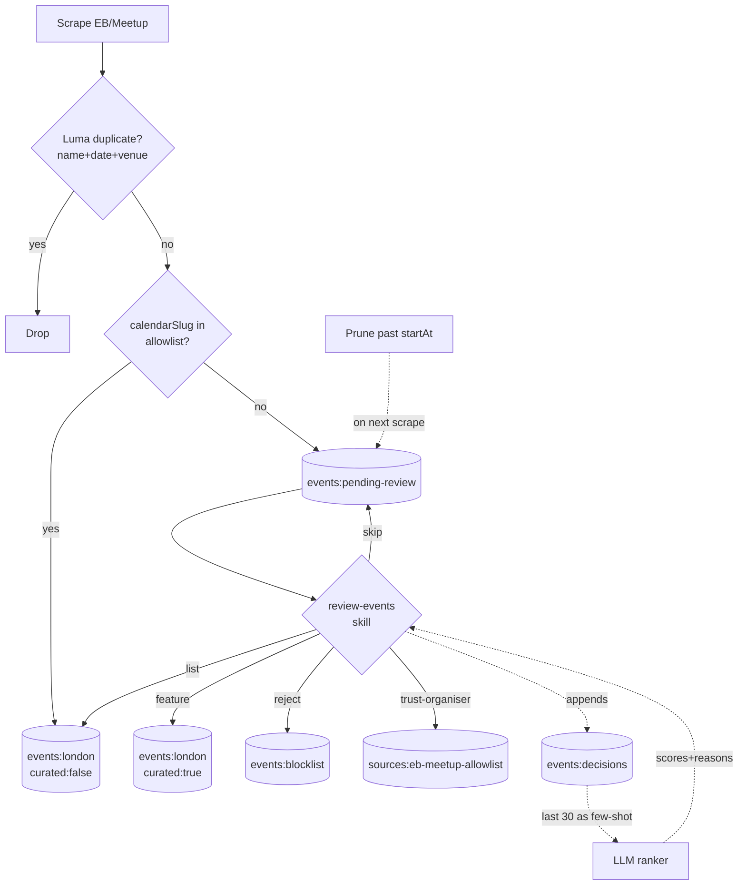

# Eventbrite/Meetup Quality Curator

## Overview

Two-track ingestion for Eventbrite and Meetup events: a slug-based allowlist for trusted recurring sources (mirroring the Luma `CALENDAR_SOURCES` pattern), and a hide-by-default review queue for everything else. Reviews happen via a Claude Code skill — the agent ranks 10–20 candidates with an LLM (Haiku, batched, JSON-structured), the user replies with `feature` / `list` / `reject` / `skip` / `trust-organiser` (+ optional reason), and decisions feed back as few-shot examples for the next session. No UI changes, no schema changes — re-uses existing `curated` field + `events:blocklist` + `events:london` plus three new KV paths. Mirrors the architectural shape of the recently-shipped `add-events` skill: write primitive + skill on top.

## Problem Frame

`/events` is polluted with low-signal Eventbrite/Meetup content (off-topic spam plus on-topic-but-corporate dross), and many entries have no cover image which makes the feed look ugly. Real gems exist but get lost. The user wants to act as curator — pull from trusted recurring sources, hand-review everything else, and let an LLM that learns from past decisions accelerate the long-tail discovery loop. Luma stays untouched because it's already well-curated.

(see origin: `docs/brainstorms/2026-04-29-events-quality-curator-requirements.md`)

## Requirements Trace

- **R1** Events without cover images are NOT dropped at scrape time (per user clarification 2026-04-29: image absence may reflect a scraper bug, not a real "no image" event). Image presence becomes a soft signal in the ranker. Non-allowlisted no-image events flow through the review queue like everything else; allowlisted no-image events auto-publish (trust the source).
- **R2** Two-track ingestion: allowlist auto-publishes; rest lands in pending queue.
- **R3** Cross-platform dedup — Luma always wins over EB/Meetup duplicates.
- **R4** Review skill `/review-events` with batched LLM ranking and inline accept/reject loop.
- **R5** Durable decision log `events:decisions` with `{id, name, organiser, decision, reason?, timestamp}`.
- **R6** Learning loop — last ~30 decisions injected as few-shot examples in the ranker prompt.
- **R7** `trust-organiser` reply adds source key to allowlist mid-review.
- **R8** Past-startAt events in pending queue auto-pruned on next scrape.

## Scope Boundaries

**In scope**
- Modifications to `eventbrite.ts`, `meetup.ts`, `index.ts` (no-image filter, source-key surfacing, pre-write routing)
- Three new KV paths and helpers in `src/lib/kv.ts`
- Cross-platform dedup helper in `src/lib/scrapers/dedup-utils.ts`
- New `@anthropic-ai/sdk` dependency + `ANTHROPIC_API_KEY` env var
- New ranker module under `src/lib/llm/`
- New `scripts/review-events.ts` primitive + `.claude/skills/review-events/` skill

**Out of scope (per origin doc)**
- Per-organiser aggregated score table — the few-shot decision log carries enough signal in v1
- Auto-rejection from "known-bad" organisers — soft signal only via LLM context
- Admin UI / `/admin` page changes — review is Claude Code only
- LLM filtering of Luma sources
- Image-content quality assessment (presence ≠ quality, but presence is enough for v1)
- Surfacing rejected events anywhere — rejected = blocklist = invisible
- Tests / new test infra (per user preference: "Bare minimum + strong extensible core")
- Cron-driven LLM calls — review is on-demand only

## Context & Research

### Relevant Code and Patterns

- `src/lib/scrapers/eventbrite.ts:mapEvent` — already reads `image.url`, `primary_organizer.name`, `primary_organizer.id`. Add no-image guard + populate `calendarSlug` with `eventbrite:<organiser-id-or-slug>`.
- `src/lib/scrapers/meetup.ts:mapEvent` — `featuredEventPhoto.highResUrl ?? null` confirms R1; `group.urlname` is in the GraphQL query but currently dropped before reaching `LondonEvent`. Surface it as `calendarSlug: meetup:<urlname>`.
- `src/lib/scrapers/index.ts:runAllScrapers` — current orchestrator runs Promise.allSettled, dedupes by ID then slug, applies blocklist. Insert allowlist-split + cross-platform dedup before final `saveEvents`.
- `src/lib/scrapers/dedup-utils.ts:dedupeBySlug` — existing slug-dedup pattern to extend with cross-platform matcher.
- `src/lib/kv.ts` — established helper shape: `get*`, `add*`, `update*`, `remove*` per concept; `redis.set(key, JSON.stringify(...))` for arrays. Mirror exactly for new paths.
- `src/lib/types.ts:LondonEvent` — already has `calendarSlug?: string` (set by Luma scrapers today). Reuse as the source key. No type-union changes needed; `source` stays as `'eventbrite'` / `'meetup'`.
- `scripts/add-event.ts` + `.claude/skills/add-events/SKILL.md` — architectural template: thin write primitive, agent in the skill handles UX + LLM logic. Mirror exactly.
- `src/app/api/admin/route.ts` — confirms admin already has `delete-event` (writes to blocklist). Skill's `reject` action must hit the same blocklist path so admin and skill agree.

### Institutional Learnings

- User feedback memory: *"Bare minimum + strong extensible core — default to smallest change; defer test infra, speculative hardening, while-we're-here cleanups."* → no test files, no schema migrations, no admin-UI work.
- User feedback memory: *"Main branch parity"* → no UI changes on `/events`, `/explore`, `/guide`. Only KV-layer + scraper-layer + new skill/script.
- The `add-events` shipping pattern (this worktree, two days ago): two artifacts (script + skill) for an agent-native feature. Same shape here — review skill + ranker library + queue infra.

### External References

- Anthropic SDK — `@anthropic-ai/sdk` (latest). Must include prompt caching per the `claude-api` skill's standing instructions. Specifics deferred to implementation; the structural decisions are: `claude-haiku-4-5-20251001` model, tool-use for structured output, cache the system prompt + decision-log block.

## Key Technical Decisions

| Decision | Rationale |
|---|---|
| **Allowlist storage = KV path `sources:eb-meetup-allowlist`** (mutable, mirrors `sources:community`). Format: `string[]` of source keys like `meetup:tech-startups-in-the-pub-relaxed-networking` or `eventbrite:<organiser-id>`. | Skill writes via `trust-organiser`; never requires a code PR to allowlist a new source. Hardcoding in `sources.ts` would block agent-native growth. |
| **Source key on `LondonEvent.calendarSlug`** for both EB and Meetup. Format: `<provider>:<provider-specific-slug-or-id>`. Field already exists, never blank. | Uniform allowlist lookup: `allowlist.has(event.calendarSlug)`. Avoids new field. Meetup uses `group.urlname` (always present in API). EB uses `primary_organizer.id` if surfaced, else slugified name. |
| **Pending queue = `events:pending-review`** (separate KV key, sibling of `events:london` and `events:manual`). | Hide-by-default guarantees no dross slips into `/events` before review. Mirrors the `events:manual` separation already proven by `getEvents()` merge. |
| **`getEvents()` is unchanged.** Pending events are NOT merged into `/events`. They surface only via the review skill. | Cleanest invariant. The user already explicitly said "No EB/Meetup event ever reaches `/events` without explicit approval." |
| **Decision log = `events:decisions`** (durable, append-only, no rotation in v1). Shape: `{id, name, organiser, decision: 'feature' \| 'list' \| 'reject', reason?: string, timestamp}`. | At ~5 review sessions/month × ~20 decisions = 1k/year ≈ 30KB. Negligible. Cap can be added in v2 if it ever bloats. |
| **Cross-platform dedup signature** = `normalise(name)` + `startAt.slice(0,10)` (date) + `venue prefix match`. Normalisation: lowercase, strip punctuation, collapse whitespace. | Catches obvious cross-platform repeats without fuzzy-match libraries. Imperfect — admin can blocklist remaining duplicates manually. Documented as best-effort. |
| **Anthropic model = `claude-haiku-4-5-20251001`**, single batched call (≤20 events/call), tool-use with strict JSON schema, system+few-shot blocks cached. | Haiku is fast + cheap (<$0.10/session at projected volume). Tool-use is the most reliable structured-output mechanism. Cache hit on every same-session call after the first. |
| **No automated tests in v1.** Manual verification via `npm run scrape` + `/review-events`. | Per user preference. The plan does spell out scenarios per unit so verification stays disciplined. |
| **No-image events are NOT dropped at scrape time** (clarified post-brainstorm). Image presence becomes a soft signal in the LLM ranker. | Meetup's image extraction is unreliable; dropping events on missing image would lose legitimate ones. Queue routing + ranker scoring handle this gracefully without a hard cutoff. |
| **Decision log retention = forever.** Pass last 30 to LLM as few-shot. | Matches user statement in brainstorm: build profile over weeks. No premature optimisation. |
| **Ranker fail-soft.** If LLM call fails (network, rate-limit, parse error), skill falls back to chronological-order presentation with no scores; user can still review. | Pipeline degradation principle from brainstorm Q9 carry-forward. Avoids "the curator is locked out because Claude API is down." |

## Open Questions

### Resolved During Planning

- **Allowlist storage location?** → KV `sources:eb-meetup-allowlist`. Mutable via skill.
- **Cross-platform dedup algorithm?** → `normalise(name) + same-day + venue-prefix`. Best-effort, imperfect.
- **Anthropic SDK setup?** → `@anthropic-ai/sdk`, Haiku 4.5, tool-use, prompt-cached system+few-shot block. Detailed prompt structure deferred to Unit 5 implementation but consult the `claude-api` skill at that point.
- **Decision log retention?** → forever, pass last 30 as few-shot.
- **Generic-organiser edge case for `trust-organiser`?** → resolved by the calendarSlug invariant: every EB/Meetup event has one. Meetup's `group.urlname` is always set; EB falls back to organiser ID, then slugified name. If all are missing (extreme edge case), skill prints a refusal with the `id` and asks user to blocklist directly.
- **Meetup `coverUrl` reliability?** → confirmed by reading `meetup.ts`. `featuredEventPhoto?.highResUrl ?? null` is the canonical pattern; null means no image. R1 is safe.

### Deferred to Implementation

- **Exact tool-use JSON schema for the ranker.** Sketch is `{ranked: [{eventId, score: 0..1, reason: string, suggestedDecision: 'feature'|'list'|'reject'}]}`, but the suggestedDecision-vs-score balance comes out of seeing real outputs.
- **Prompt-cache breakpoint placement.** First implementation puts cache_control on the system prompt + the decision-log block. Tune once we see usage metrics.
- **Whether to seed the allowlist with the user's example** (`meetup.com/tech-startups-in-the-pub-relaxed-networking`) at install time, or leave it blank. Probably yes — small win, no harm.
- **Stdin parsing UX** in the review CLI (one event at a time vs interactive prompt). Mirror `add-event.ts` decision style — start simplest, iterate.
- **Whether the ranker pre-writes a `suggestedDecision` straight to events:london when its score is very high** (e.g. >0.95 with a clear `feature` suggestion). v1 says no — human always confirms. Could relax later.

## High-Level Technical Design

> *This illustrates the intended approach and is directional guidance for review, not implementation specification. The implementing agent should treat it as context, not code to reproduce.*

### Event lifecycle through the pipeline



### Source key shape (`LondonEvent.calendarSlug`)

```
meetup:<group.urlname>                           // e.g. meetup:tech-startups-in-the-pub-relaxed-networking
eventbrite:<primary_organizer.id>                // numeric/slug ID from EB API
eventbrite:org-<slugify(primary_organizer.name)> // fallback when ID missing
```

### Decision log shape

```
{
  id: "meetup-12345",
  name: "Tech Startups in the Pub",
  organiser: "meetup:tech-startups-in-the-pub-relaxed-networking",
  decision: "feature" | "list" | "reject",
  reason?: "great vibe, builders",
  timestamp: "2026-04-29T18:23:00Z"
}
```

### Ranker tool-use schema (sketch)

```
rank_events(events: [{id, name, organiser, description?, tags, locationName, startAt}])
  → { ranked: [
      { eventId: "meetup-...",
        score: 0.0..1.0,
        reason: "≤1 sentence",
        suggestedDecision: "feature" | "list" | "reject"
      }
    ] }
```

System prompt anchors the bar ("starter-london is for active builders/founders/engineers in tech, AI, deeptech..."). Few-shot block injects last 30 user decisions.

## Implementation Units

- [ ] **Unit 1 — Source keys + allowlist + pending queue**

**Goal:** Land the queue infrastructure: surface a `calendarSlug` on every EB/Meetup event, persist a mutable allowlist in KV, route events to either `events:london` or new `events:pending-review` based on allowlist match, and prune past-startAt pending events on each scrape.

**Requirements:** R2, R8

**Dependencies:** None.

**Files:**
- Modify: `src/lib/scrapers/eventbrite.ts` (populate `calendarSlug` from `primary_organizer.id` or fallback to `org-<slugify(name)>`)
- Modify: `src/lib/scrapers/meetup.ts` (extend GraphQL query response handling — `group.urlname` is already in the query; just stop dropping it. Populate `calendarSlug: meetup:<urlname>`)
- Modify: `src/lib/kv.ts` — add helpers:
  - `getEbMeetupAllowlist(): Promise<string[]>`
  - `addToEbMeetupAllowlist(key: string): Promise<void>`
  - `removeFromEbMeetupAllowlist(key: string): Promise<void>`
  - `getPendingReview(): Promise<LondonEvent[]>`
  - `setPendingReview(events: LondonEvent[]): Promise<void>` (overwrite — pending queue is regenerated each scrape)
  - `getDecisions()` / `appendDecision()` (defer to Unit 4, but the KV path layout is consistent)
- Modify: `src/lib/scrapers/index.ts` — after the existing dedup pass, partition EB/Meetup events:
  - Allowlisted → keep in the to-be-saved set
  - Non-allowlisted with `startAt >= now` → write to `events:pending-review`
  - Non-allowlisted with `startAt < now` → drop (auto-prune R8)

**Approach:**
- The pending queue is **fully regenerated** each scrape from the latest non-allowlisted candidates. Items already-decided (in `events:london` curated, in `events:blocklist`, or already pending) are filtered before the regenerate so the user never re-judges the same event:
  - Skip if `event.id` exists in current `events:london` (already promoted).
  - Skip if `event.id` exists in `events:blocklist` (already rejected).
  - Skip if `event.id` exists in current pending queue with no recent decision change (carries over).
- Past-startAt events filter naturally falls out of the regenerate step.
- Add a small console log per scrape: `[scrapers] N events → allowlist, M → pending queue`.

**Patterns to follow:**
- `kv.ts:getCommunitySources` / `addCommunitySource` / `removeCommunitySource` is the exact mutable-KV-list pattern to mirror for the allowlist.
- `kv.ts:saveEvents` / `getRawEvents` is the array-overwrite pattern to mirror for `events:pending-review`.

**Test scenarios:**
- Allowlisted Meetup group → event lands in `events:london` with `curated: false`.
- Non-allowlisted Meetup event → lands in `events:pending-review`.
- Allowlisted Eventbrite organiser → events:london.
- Non-allowlisted EB event → pending-review.
- Pending event whose `startAt` is in the past at next scrape → dropped from pending.
- Allowlisted source removed mid-cycle → next scrape moves its events to pending (regenerate handles this).
- Event already in `events:london` (e.g. previously approved via skill) → not duplicated into pending on rescrape.
- Event already in `events:blocklist` → not resurfaced into pending.

**Verification:**
- `npm run scrape` produces a non-empty `events:pending-review` and a non-trivial `events:london`.
- The two sets are disjoint by event ID.
- `/events` continues to show only `events:london` + `events:manual` content (no leakage of pending).

---

- [ ] **Unit 2 — Cross-platform dedup**

**Goal:** When the same event appears on Luma and Eventbrite/Meetup, drop the EB/Meetup version. Runs *before* the allowlist split so duplicates never enter the pending queue.

**Requirements:** R3

**Dependencies:** Unit 1 (the allowlist split is the right insertion point for this dedup pass).

**Files:**
- Modify: `src/lib/scrapers/dedup-utils.ts` — add `dedupeAcrossPlatforms(events: LondonEvent[]): LondonEvent[]`. Strategy: build a map of `<normalised-name>|<startAt-date>|<venue-prefix>` → first Luma event seen; subsequent EB/Meetup matches are dropped.
- Modify: `src/lib/scrapers/index.ts` — call `dedupeAcrossPlatforms` after the existing `dedupeBySlug` pass, before the allowlist split.

**Approach:**
- Normalisation: `name.toLowerCase().replace(/[^a-z0-9 ]/g, ' ').replace(/\s+/g, ' ').trim()`.
- Venue prefix: first 20 chars of `locationName.toLowerCase().trim()`. Tolerates "1 Triton Square" vs "1 Triton Square, London NW1".
- Date key: `startAt.slice(0, 10)` (YYYY-MM-DD). Avoids timezone-comparison wobble.
- "Luma" = `event.source` is `luma-discovery` / `luma-calendar` / `luma-profile` / `cerebral-valley`. EB/Meetup victims = `eventbrite` / `meetup`.
- Log dropped duplicates so admin can spot false positives: `[dedup] dropped EB '<name>' as cross-platform dup of Luma`.

**Patterns to follow:**
- `dedupeBySlug` in the same file is the model for "filter array by computed key".

**Test scenarios:**
- Same event on Luma + EB with identical name and venue → EB dropped.
- Same name, same date, *different* venue → both kept.
- Same name, *different* date → both kept.
- Title typo ("Demo Night #14" vs "Demo Night #14 (rescheduled)") → unmatched (acceptable false negative; documented in plan).
- All Luma-only events → unaffected.
- All EB/Meetup-only events → unaffected.

**Verification:**
- After a scrape with a known cross-platform duplicate, only one (Luma) appears in `events:london`.

---

- [ ] **Unit 3 — Decision log + KV helpers**

**Goal:** Durable append-only log of every review decision. Read by the ranker (Unit 5) for few-shot context; written by the review skill (Unit 6).

**Requirements:** R5, R6 (data store half)

**Dependencies:** None (pure KV).

**Files:**
- Modify: `src/lib/types.ts` — add `EventDecision` interface (id, name, organiser, decision, reason?, timestamp).
- Modify: `src/lib/kv.ts` — add:
  - `getDecisions(): Promise<EventDecision[]>` (returns all, oldest-first)
  - `getRecentDecisions(n: number): Promise<EventDecision[]>` (returns last n, newest-first)
  - `appendDecision(decision: EventDecision): Promise<void>` (idempotent — same id+timestamp is a no-op; same id with later timestamp appends a new entry, which is correct because the user *can* re-decide).

**Approach:**
- Same `events:decisions` key shape as other arrays: JSON-serialised array, full overwrite on append. Append → read full array, push, write back.
- No retention cap in v1 (~1k entries/year is negligible).

**Patterns to follow:**
- `kv.ts:logFailedSources` (write-array pattern) and `kv.ts:getCommunitySources` (read-array pattern).

**Test scenarios:**
- Empty store → `getDecisions()` returns `[]`.
- Append 3 decisions → `getDecisions()` returns 3 in chronological order.
- `getRecentDecisions(2)` returns last 2, newest-first.
- Appending a decision for a blocked event ID → still recorded (decisions are independent of event records).

**Verification:**
- A throwaway test script appending and reading 5 decisions confirms ordering and persistence.

---

- [ ] **Unit 4 — Anthropic SDK + ranker library**

**Goal:** Add the `@anthropic-ai/sdk` dependency and a ranker module that scores a batch of pending events using past decisions as few-shot examples. Pure library — no I/O beyond Anthropic. Skill (Unit 5) calls this.

**Requirements:** R4 (LLM half), R6 (learning loop half), R1 (image-presence soft signal)

**Dependencies:** Unit 3 (reads decisions). Unit 1 (reads pending queue — though the ranker itself only takes events as args; the script orchestrates).

**Files:**
- Modify: `package.json` — add `@anthropic-ai/sdk` to `dependencies`. Add `ANTHROPIC_API_KEY` to the documented env var list (CLAUDE.md update is bundled in Unit 6).
- Create: `src/lib/llm/event-ranker.ts` — exports:
  - `rankEvents(events: LondonEvent[], recentDecisions: EventDecision[]): Promise<RankedEvent[]>`
  - `interface RankedEvent { eventId: string; score: number; reason: string; suggestedDecision: 'feature' | 'list' | 'reject' }`

**Approach:**
- Single batched call. If the input array is >20, chunk to ~20-event batches and concat results.
- Tool-use mode for structured output: define a `rank_events` tool with strict JSON schema; the model must invoke it exactly once.
- System prompt anchors the quality bar — short, specific to starter-london's audience (active builders/founders/engineers in tech/AI/deeptech in London). Image presence is a soft signal: events without `coverUrl` should score slightly lower (they look messy in the feed) but are NOT auto-rejected — Meetup's scraper sometimes misses images for legitimate events.
- Few-shot block: render last 30 decisions as `[<decision> ✕ <name> by <organiser> — <reason>]`, grouped feature/list/reject for clarity.
- Prompt caching: `cache_control: { type: 'ephemeral' }` on the system prompt and the few-shot block. The candidate-events block is the un-cached suffix per call.
- Model: `claude-haiku-4-5-20251001`. Hard-coded for v1; revisit if quality is poor.
- Fail-soft: if the call throws, return events unranked (`score: 0.5`, `reason: '(LLM unavailable)'`, `suggestedDecision: 'list'`). The skill surfaces this state to the user.

**Execution note:** Consult the `claude-api` skill (compound-engineering plugin) when implementing the prompt-cache breakpoints and tool-use call shape — it has the canonical patterns.

**Patterns to follow:**
- The skill's stated requirement: "Apps built with this skill should include prompt caching." Bake in from day one.

**Test scenarios:**
- Empty events → returns `[]` without calling Anthropic.
- 5 events, 0 decisions → returns 5 ranked entries (no few-shot context, generic ranking).
- 20 events, 30 decisions → all 20 returned with score + reason; few-shot block referenced in cached portion.
- 35 events → chunked into 2 calls; concatenated result has 35.
- Anthropic 429 / 500 / network error → ranked array returned with all `score: 0.5, reason: '(LLM unavailable)'` and a thrown-aside warning the caller can surface.
- Model returns invalid tool-use args (rare) → fail-soft same as above.

**Verification:**
- Run `tsx -e 'import { rankEvents } from "./src/lib/llm/event-ranker"; ...'` against 5 hand-crafted events; output looks plausible (Barclays-style event scores lower than a builder-aimed one).
- Anthropic API logs show prompt-cache hit on the second call within a session.

---

- [ ] **Unit 5 — Review CLI + skill**

**Goal:** The user-facing surface. `npm run review-events` opens an interactive review session: ranker scores pending events, agent walks user through them one at a time, replies route to `events:london` / `events:blocklist` / `sources:eb-meetup-allowlist`, decisions append to log. Skill markdown captures the workflow so `/review-events` triggers it consistently.

**Requirements:** R4, R5 (write half), R6 (write half), R7

**Dependencies:** Units 1, 3, 4.

**Files:**
- Create: `scripts/review-events.ts` — the primitive. Reads pending queue, calls ranker, prints inline, reads stdin replies, persists.
- Create: `.claude/skills/review-events/SKILL.md` — agent playbook: when to invoke, expected reply syntax, how to handle ambiguous events, how to escalate to user when LLM is uncertain.
- Modify: `package.json` — add `"review-events": "npx tsx --env-file=.env.local scripts/review-events.ts"`.
- Modify: `CLAUDE.md` — under "Scraper System", add a one-paragraph subsection on the review queue + skill, and document `ANTHROPIC_API_KEY` env var.

**Approach (script):**
- Args: optional `--limit N` (default 20), `--dry-run` (no writes).
- Flow:
  1. Read pending queue (`getPendingReview`) and recent decisions (`getRecentDecisions(30)`).
  2. If pending is empty → print "Nothing to review" and exit 0.
  3. Slice top N by some seed order (creation order? randomise? — start with creation order; agent can re-order conceptually via the LLM ranking).
  4. Call `rankEvents(slice, recentDecisions)`.
  5. Sort by score desc, present one event at a time:
     ```
     [ 1/15 · score 0.82 · suggested: feature ]
     "Tech Startups in the Pub — Relaxed Networking"
     organiser: meetup:tech-startups-in-the-pub-relaxed-networking
     when: Wed 7 May · 18:00 BST · The Bridge Pub, Bermondsey
     image: https://...
     LLM: builders-aimed; recurring; previous similar events accepted
     reply: feature | list | reject | skip | trust-organiser [+ optional reason]
     >
     ```
  6. Read stdin line, parse first token as command, remainder as reason. Persist immediately (so a mid-session crash never loses decisions).
  7. Continue until queue exhausted, user types `q` / `quit`, or `--limit` reached.
  8. Print summary: `N featured · M listed · K rejected · J trusted · S skipped`.

**Approach (skill markdown):**
- Mirror the structure of `add-events/SKILL.md`: frontmatter (name, description with triggers), workflow, command reference, "things to watch", error modes.
- Document the `trust-organiser` graceful refusal (when calendarSlug is somehow blank — extreme edge case).
- Mention that `reject` writes to `events:blocklist` so the same event can never be resurrected by a future scrape (consistent with `add-events`' blocklist guarantee).

**Persistence semantics:**
- `feature`: read pending, find event, set `curated: true`, append to `events:london` (or update if already there), remove from pending; append decision.
- `list`: same as feature but `curated: false`.
- `reject`: add `id` to `events:blocklist`; remove from pending; append decision.
- `skip`: leave in pending; do NOT append a decision (skipping isn't a judgement).
- `trust-organiser`: add `event.calendarSlug` to allowlist; the event itself is treated as `list` by default (visible non-badged) unless the reply also includes `feature`. Append a `'feature'` or `'list'` decision (whichever was implicit).

**Patterns to follow:**
- `scripts/add-event.ts` for: argv parsing, env loading, async stdin loop, summary line.
- `.claude/skills/add-events/SKILL.md` for: frontmatter shape, workflow narration, "things to watch" closing.

**Test scenarios:**
- Empty pending → exits with "Nothing to review".
- 3 pending events → 3 prompts; decisions persisted between prompts.
- Reply `feature great vibe` → event in `events:london` with `curated: true`; decision logged with `reason: 'great vibe'`.
- Reply `reject` → event in `events:blocklist`; decision logged.
- Reply `skip` → event still in pending; no decision logged.
- Reply `trust-organiser` → calendarSlug appended to `sources:eb-meetup-allowlist`; event listed.
- Reply `trust-organiser` for an event with empty calendarSlug → script prints a one-line refusal and re-prompts.
- Mid-session SIGINT → exit cleanly; decisions made so far are persisted.
- Anthropic API down (ranker fail-soft) → events still presented in queue order with `(LLM unavailable)` reasons; user can still review.
- Re-running the script when pending queue has been emptied (all reviewed) → "Nothing to review".

**Verification:**
- End-to-end smoke run: `npm run scrape` (populates pending), `npm run review-events --dry-run` (no persistence, just verifies presentation), then `npm run review-events` for real on 3-5 events. `/events` reflects the decisions on next page load.
- Decision log has 3-5 entries.
- Scrape again; previously-reviewed events do not reappear in pending.

## System-Wide Impact

- **Interaction graph:**
  - `runAllScrapers()` gains 3 new write paths (`events:pending-review`, `events:decisions` indirectly via skill, `sources:eb-meetup-allowlist` indirectly via skill).
  - `getEvents()` is **deliberately unchanged** — pending and decisions never leak into `/events`.
  - `/api/admin` POST `delete-event` action already adds to blocklist; review skill's `reject` does the same — single source of truth.
- **Error propagation:**
  - Anthropic API failure → ranker fail-soft → skill presents events anyway with a flag. No blast radius.
  - KV write failure during review → script surfaces the error, leaves event in pending; user can retry.
  - Pending queue regeneration failure mid-scrape → other scrapers' results still save; pending queue retains stale state until next scrape.
- **State lifecycle risks:**
  - **Race**: user reviews while cron is mid-scrape — script reads pending, cron rewrites pending. Mitigation: pending queue regenerate filters out anything already in `events:london` (because user just `feature`d it) and `events:blocklist` (because user just rejected it). The review skill writes those *first*, then the decision log. Result: regeneration may briefly re-add the event, but next scrape re-removes it.
  - **Allowlist mid-flight**: user `trust-organiser`s during a review session; events from that source already in pending get treated as still-pending until next scrape. Acceptable.
  - **Decision-log unbounded growth**: capped by attention; revisit if it ever hits ~10k entries.
- **API surface parity:** none — skill is local-only.
- **Integration coverage:** the 3-state event lifecycle (allowlisted / pending / blocklisted) is covered by the regeneration logic in Unit 2; manual end-to-end confirms cross-unit correctness.

## Risks & Dependencies

| Risk | Mitigation |
|---|---|
| Anthropic API key absent → script fails at runtime. | Script reads env var at start; fails with clear "set ANTHROPIC_API_KEY in .env.local" before doing any work. Documented in CLAUDE.md (Unit 6). |
| Cost overrun (LLM per session). | Haiku 4.5 + prompt cache + ≤20 events/session ≈ $0.05/session. Volume is bounded by user's review cadence, not cron. Cost ceiling not at risk. |
| Cross-platform dedup false positives (Luma event suppresses a legitimately-different EB event with same name on same day). | Dedup logs each drop so admin can spot it. User can `addManualEvent` if they really want it back. Acceptable v1 trade-off. |
| `calendarSlug` blank for some Eventbrite events (organiser ID + name both missing). | Generate a deterministic fallback: `eventbrite:url-<sha1(eventbrite-url).slice(0,8)>`. Documented in Unit 2 approach. Truly orphan events still get a usable allowlist key. |
| Pending queue inflates to thousands of events (low filter precision). | Past-startAt prune (R8) caps temporal growth. SOURCES_PER_RUN cap in `index.ts` is unchanged; ingest rate is bounded. |
| User abandons reviews → pending queue stagnates. | Past-startAt prune handles this naturally. Stale items quietly fall off as their start date passes. |
| Decision log retention forever bloats KV. | At projected rate ≈ 30KB/year. Cap can land in v2 if needed. |
| Mid-session crash loses decisions. | Each decision persists immediately on user reply, not at end. Loss bounded to "the reply currently being typed". |

## Documentation / Operational Notes

- **CLAUDE.md update** in Unit 6: a new sub-section under "Scraper System" describing the review queue, the skill, and the new env var. Brief — under 25 lines.
- **No cron changes**. `vercel.json` untouched. Vercel cron continues running daily; the new logic happens entirely inside the existing scrape pipeline.
- **No deployment dance**. New KV paths self-create on first write. No backfill needed; pending queue starts empty and populates on next scrape.
- **`.env.local` change**: add `ANTHROPIC_API_KEY=...`. User must source this from console.anthropic.com. Local-only — Vercel cron doesn't need it because cron doesn't run the LLM ranker.

## Phased Delivery

### Phase 1 — Ship-now (Units 1–5 together)

All five units land as the v1 release. They form a coherent feature: queue + dedup + log + ranker + skill. Splitting them into separate releases would leave the user with a half-built tool (e.g. shipping the queue without the skill means no way to drain pending events).

**Order within Phase 1**:
1. Units 1 + 2 — queue and dedup foundation, can be implemented in parallel commits.
2. Unit 3 (decision log) — small, unblocks Unit 4.
3. Unit 4 (ranker library) — pure module.
4. Unit 5 (script + skill) — depends on all above; the closing piece.

### Phase 2 — Deferred (NOT in this plan)

Mentioned in the requirements doc as out-of-scope-v1; documented here so they're not lost:
- Per-organiser score aggregation (replace few-shot with structured priors)
- Auto-reject from low-trust organisers (raise the LLM's autonomy)
- Admin UI surface for reviews (visual review alongside chat-based)
- Image-content quality assessment

## Sources & References

- **Origin document:** [docs/brainstorms/2026-04-29-events-quality-curator-requirements.md](../brainstorms/2026-04-29-events-quality-curator-requirements.md)
- **Related code:**
  - `src/lib/scrapers/eventbrite.ts:mapEvent` — current EB shaping
  - `src/lib/scrapers/meetup.ts:mapEvent` (line 35) — current Meetup shaping; note `group.urlname` already in query, currently dropped
  - `src/lib/scrapers/index.ts:runAllScrapers` — orchestrator; insertion point for queue split + cross-platform dedup
  - `src/lib/scrapers/dedup-utils.ts:dedupeBySlug` — pattern to extend
  - `src/lib/kv.ts:getCommunitySources` / `addCommunitySource` — pattern for mutable KV list (allowlist)
  - `src/lib/kv.ts:saveEvents` — pattern for full-overwrite array (pending queue)
  - `src/lib/types.ts:LondonEvent` — uses existing `calendarSlug` field for source key
  - `src/app/api/admin/route.ts:127-141` — confirms `events:blocklist` is the single source of truth for "rejected"
  - `scripts/add-event.ts` + `.claude/skills/add-events/SKILL.md` — architectural template for the new script + skill
- **External docs:**
  - Anthropic SDK (`@anthropic-ai/sdk`) — consult `claude-api` skill for caching + tool-use specifics during Unit 5 implementation
- **Worktree:** `.claude/worktrees/extra-events` (branch `worktree-extra-events`)
